# Bandit
Bandit wargame is aimed at beginners. Those tasks are really great to learn Linux commands, or revise your knowledge after a long break from using Linux based OS.

You definitelly should try to beat this game at your own. Use this writeup only if you're stuck at some point.

## Jump to:
- [Level 0](#level-0---level-1)
- [Level 1](#level-1---level-2)
- [Level 2](#level-2---level-3)
- [Level 3](#level-3---level-4)
- [Level 4](#level-4---level-5)
- [Level 5](#level-5---level-6)
- [Level 6](#level-6---level-7)
- [Level 7](#level-7---level-8)
- [Level 8](#level-8---level-9)
- [Level 9](#level-9---level-10)
- [Level 10](#level-10---level-11)
- [Level 11](#level-11---level-12)
- [Level 12](#level-12---level-13)
- [Level 13](#level-13---level-14)
- [Level 14](#level-14---level-15)
- [Level 15](#level-15---level-16)
- [Level 16](#level-16---level-17)
- [Level 17](#level-17---level-18)
- [Level 18](#level-18---level-19)
- [Level 19](#level-19---level-20)

## Level 0
Your task is to connect to the remore host using SSH protocol. Address, port and credentials are provided in level description.

The way i recommend is using Linux shell command:
~~~bash
ssh username@host_address -p port_number
~~~ 

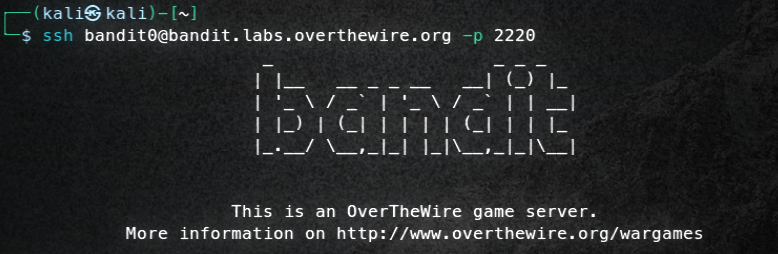

That's it, you are ready to go.

## Level 0 -> Level 1
Description says, that password for user bandit1 is stored in readme file. Lets find it.
Use ls command to list content of directory you are in. There is a readme file that you can print into terminal using cat command.

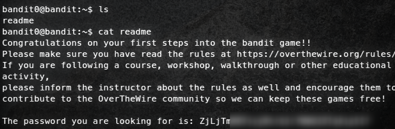

## Level 1 -> Level 2
Use SSH again to login into remote host, this time use bandit01 and password that we've found in prievous task.

This time we are dealing with file called "-". Trying to print it using cat will fail, beacause shell recognise - char as that command parameters start with.
We can bypass this by using relative path to the file. Try using "./", which means "in this directory".

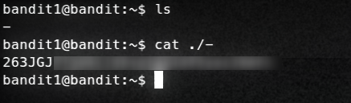

And now we have the password for bandit2 user.

## Level 2 -> Level 3
To obtain password, we need to open file called "--spaces in this filename--". Trying to use it directly will not work. 
Firstly, "--" is also recognized as command parameter, but we already know how to bypass this. Secondly, each space will break filename into separate parts. 
You can tell the shell to include space as part of the string, by using escape character "\\".

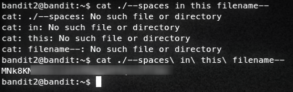

Let's go to the next level.

## Level 3 -> Level 4
We have to look for a hidden file in "inhere" directory. Let's get inside and list content of it. At first, we wont see nothing. In Linux you can add '.' to hide file, it wont be visible until using special flag. To list all files including hidden ones, use ls -a. And there it is, bandit4 password.

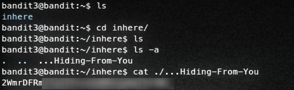

We are ready to go further.

## Level 4 -> Level 5
This time we have to find file containing password. There are several files, and description says that we will find credentials in the only human-readable file. Humans can read text, so we are looking for text file, right?
Use "file" command to find out what is type of specific file. Do you have to do it for every file? No, you can use * to check all files at once. Remember to use './'!
There is one ASCII text file, and thats our password.

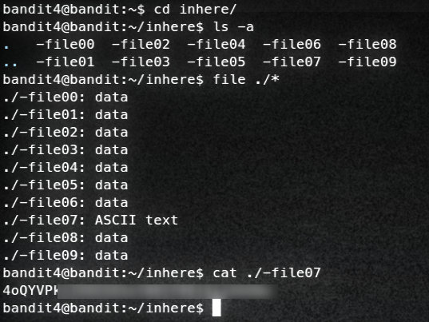

Now you can login into bandit5 account.

## Level 5 -> Level 6
File that we are looking for is human-readable, 1033 bytes in size and is not executable. When we list contents "inhere" directory we see a lot of subdirectories, each containing even more files. We could brute-force this challange by manualy checking each file, but that would take a lot of time. Command "find" will be usefull. 
First flag is -perm, which specify what permissions should file have. We can use "!" to negate criteria, so "! -perm /111", this mean that we are looking for file that have no execute bite set. Second flag is "-size 1033c", "c" stands for bites. After executing command that i've written bellow, we will see only one file matching those criteria. And thats password for bandit6 user.

~~~bash
find ./ ! -perm /111 -size 1033c
~~~

Lets move on to the next one.

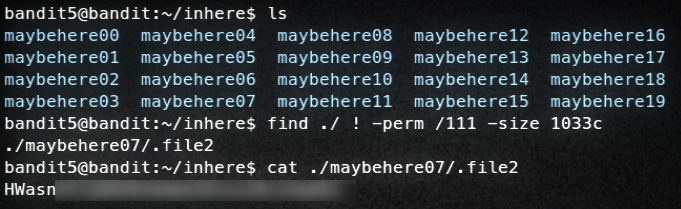

## Level 6 -> Level 7
Another challenge where find command will be usefull. This time we are looking for file that is owned by bandit7, owned by group bandit6, and have 33 bytes in size. We know that file is stored "somewhere on the server", so this time we will use "find /", where "/" means to start searching from root directory. Parameters -user and -group will let us specify user and group that file is owned by. After command execution, there are a lot of mess in terminal saying that we have no permission, and thats true. We can get rid of it by addind 2>/dev/null. And now there is only one file, and this is what we are looking for. 

~~~bash
find / -user bandit7 -group bandit6 -size 33c 2>/dev/null
~~~
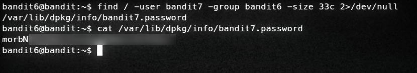

Continue by logging into bandit7 user.

## Level 7 -> Level 8
Password is stored in data.txt file next to the word "millionth". Firstly we should check how file looks like inside. In each line there is a word and string of random chars. This time we will use "grep" command, which will let us find line containing "millionth" word. 
~~~bash
cat data.txt | grep millionth
~~~

Bandit8 password is captured, time to move forward.

## Level 8 -> Level 9
Another data.txt file, but this time password is the only one unique line in whole file. Use "cat data.txt | sort | uniq -u" to find it. Sort is neccesary, because uniq works only in nearest line. Flag "-u" means that we are looking for unique value.

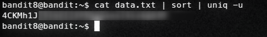

We are ready to go.

## Level 9 -> Level 10
And another one data.txt file. But is it text? No. Printing it in terminal with "cat" will result in messing up it. We can check file type with "file" comman, and we will see that this is data file. To search for ASCII strings, we can use "strings" command. Also, we know that password is preceded by several "=" charcters. Grep will also be usefull. There are four results, only one looks like a password.

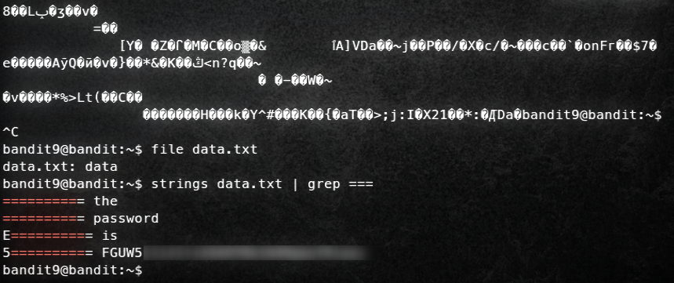

First 10 challenges done, let's go further. 

## Level 10 -> Level 11
Password in data.txt file is encoded with base64. The fastest way to decode this is using linux command "base64 --decode". Below command is firstly printing text from data.txt, then it decode it. 

~~~bash
cat data.txt | base64 --decode
~~~

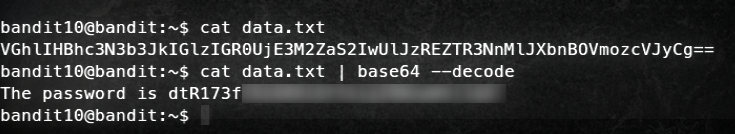

## Level 11 -> Level 12
This time a-z and A-Z characters from password have been rotated by 13 posiotions. It's called ROT13 cipher. You 
can use online tool [CyberChef](https://cyberchef.org/), select ROT13 and paste data.txt. 

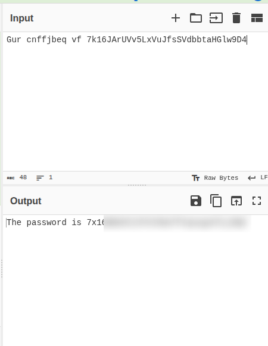

Thats it.

## Level 12 -> Level 13
We are dealing with hexdump of file that have been compressed multiple time. Description says that temporary directory will be usefull, so lets do it using "mktemp -d" and copy data.txt into it. Firstly lets see whats in this file. 
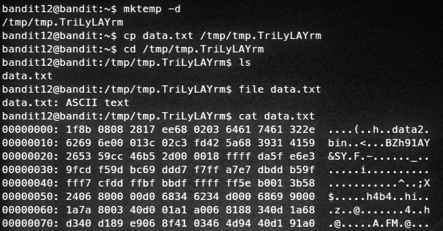

We will be using "xxd" command to convert this hexdump into archive. First we need to find what type of archive we need to get. Something called [Magic Bytes](https://en.wikipedia.org/wiki/List_of_file_signatures) will help. Take a look at:
~~~bash
00000000: 1f8b 0808 2817 ee68 0203 6461 7461 322e  ....(..h..data2.
~~~
1F 8B match GZIP. Now we can recover this archive using xxd and unzip them using "gunzip".

~~~bash
xxd -r data.txt > data.gz
gunzip data.gz
~~~

We know that it was compressed multiple times, we should check filetype and decompress it again and again.
~~~bash
bzip2 -d data
mv data.out data.gz
gunzip data.gz
tar -xf data
tar -xf data5.bin
bzip2 -d data6.bin
tar -xf data6.bin.out
mv data8.bin data8.gz
~~~
And there will be data8 file with password for bandit 13.

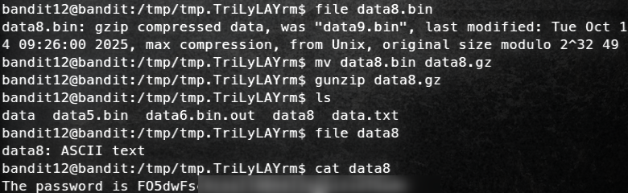

## Level 13 -> Level 14
There is no task for this one, but we are provided with ssh key for bandit14. We have to download it to our local OS, and use it to login into bandit14 account. You can download it using scp command:

~~~bash
scp -P 2220 bandit13@bandit.labs.overthewire.org:/home/bandit13/sshkey.private .
~~~

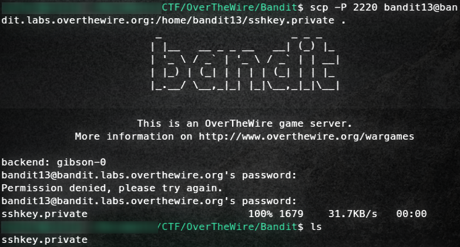

Trying to login using "-i sshkey.private" (i've renamed it into bandit14.private) will fail because of default permissions. You can fix that by using "chmod 600 sshkey.private) and then you will be able to login into bandit14 account. 

IMPORTANT NOTE
We have to save bandit14 user password for later use. Description says that it is in /etc/bandit_pass/bandit14. 

~~~bash
ssh bandit14@bandit.labs.overthewire.org -p 2220 -i sshkey.private
~~~

## Level 14 -> Level 15
We will obtain bandit15 password after submitting bandit14 password (/etc/bandit_pass/bandit14) into port 30000 on localhost. To "talk" with service running on port 30000 we can use netcat. Paste bandit14 password, and you will receive bandit15 credentials.

~~~bash
nc 127.0.0.1 30000
~~~
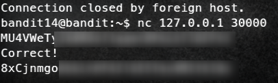

## Level 15 -> Level 16
Another challenge about submitting password to something listening on 30001 port. This time it is required to use SSL/TLS encryption. I recommend using "ncat" tool, which offer "--ssl" flag. 
~~~bash
ncat 127.0.0.1 30001 --ssl
~~~
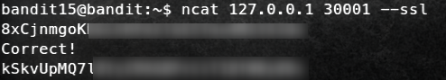

Pretty easy, right?
## Level 16 -> Level 17:
And another one. We are provided with port range that we have to check: 31000-32000. We will be using nmap to scan active ports. Use "-sT" flag to use TCP Connect scan. 

~~~bash
nmap -sT -p 31000-32000 127.0.0.1
~~~

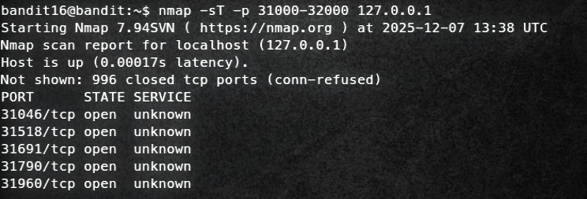

There are 5 open ports. Now we have to find out which one is using TLS/SSL encryption. Nmap offer script to do this. Perform another scan, this time add "--script ssl-enum-ciphers". Now we have 2 ports that offer SSL encryption: 31518 and 31790. Lets check them both.

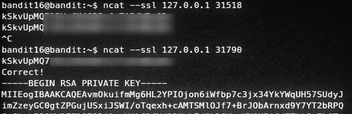

Second one returned RSA key, which we will use to login into bandit17 account. Just like on one of previous challenges. Copy whole output into file on your local machine, name it bandit18.private and set 600 permissions using chmod.

## Bandit 17 -> Bandit 18
Description says, that our password is the only line that have been change between passwords.old and passwords.new files. Using "diff" tool will be very usefull.

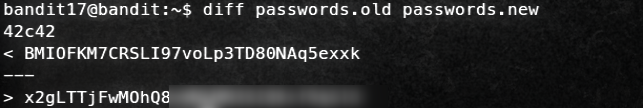

## Bandit 18 -> Bandit 19
In this challenge, password sould be in readme file. However, we are immediately logged out if we try to login using ssh. We know which file we need to read, so lets try execute command through ssh instead of loging in. To do this, simply add command that you want to exetute right after ssh flags.

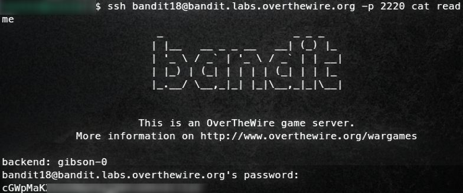

It worked!
## Bandit 19 -> Bandit 20
To obtain the password, we need to use setuid binary on /etc/bandit_pass directory. First, we have to execute binary without arguments to find out how to use it. We want to print bandit20 file from /etc/bandit_pass directory, so we can do it as bandit20 user if we use bandit20-do script. 

~~~bash
./bandit20-do cat /etc/bandit_pass/bandit20
~~~

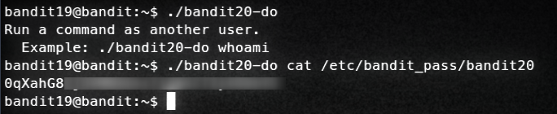

## Bandit 20 -> Bandit 21
[Tmux](https://www.redhat.com/en/blog/introduction-tmux-linux) is extreme usefull to solve this challenge. Use it to split terminal view. This time binary read password from port that we specify, and if it match bandit20 password, it will return bandit21 credential. Lest begin with opening netcat server at port 25252 using "nc -lp 25252". Then from second terminal, use provided binary with 25252 parameter. Back to netcat, paste bandit20 password and press ENTER. Thats all.

## Bandit 21 -> Bandit 22
In this task we have to investigate cron, and find out which command is being executed. You can do this by viewing config files. I used "cat /etc/cron.d/* | grep \*", to firstly check which one is being executed in regular intervals. There is one script that looks interesting - "/usr/bin/cronjob_bandit22.sh". Opening it reveal, that bandit22 password is stored in one of files in /tmp directory. And there it is - bandit22 password.

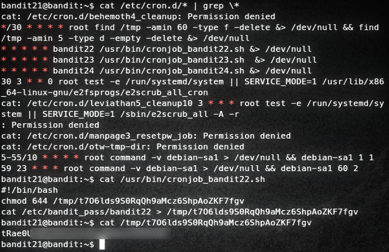

## Bandit 22 -> Bandit 23
From previous task we know, that there is another script - "/usr/bin/cronjob_bandit23.sh". We can read it easily.
~~~bash
#!/bin/bash

myname=$(whoami)
mytarget=$(echo I am user $myname | md5sum | cut -d ' ' -f 1)

echo "Copying passwordfile /etc/bandit_pass/$myname to /tmp/$mytarget"

cat /etc/bandit_pass/$myname > /tmp/$mytarget
~~~
This script take username, and create mytarget variable. We can recreate it by executing this command manually replacing $myname with bandit23. And now we know where to look for bandit23 password.

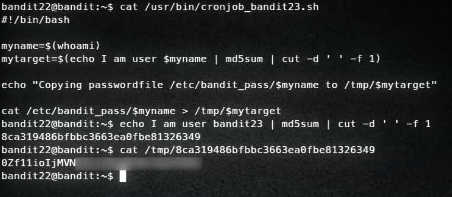

## Bandit 23 -> Bandit 24
This time we need to write our own shell script. But first, lest examine the last cron script - "/usr/bin/cronjob_bandit24.sh". 
~~~bash
#!/bin/bash

myname=$(whoami)

cd /var/spool/$myname/foo
echo "Executing and deleting all scripts in /var/spool/$myname/foo:"
for i in * .*;
do
    if [ "$i" != "." -a "$i" != ".." ];
    then
        echo "Handling $i"
        owner="$(stat --format "%U" ./$i)"
        if [ "${owner}" = "bandit23" ]; then
            timeout -s 9 60 ./$i
        fi
        rm -f ./$i
    fi
done
~~~
This script will execute every script owned by bandit23 from /var/spool/bandit24/foo directory. Lets do the following:
- create tmp directory (mktemp -d) and cd into it,then set 777 (i know, its not secure but who cares in CTF) perm for this directory, otherwise script wont be able to create file in it,
- create script that will copy bandit24 password into new file in tmp directory,
- type "chmod +x script.sh" and copy it into /var/spool/bandit24/foo director,
- and thats it, we will wait for executing this by cron.

~~~bash
#!/bin/bash
cat /etc/bandit_pass/bandit24 >> /tmp/your_tmp_directory/password.txt
~~~

Password will be in password.txt file in your tmp directory.

